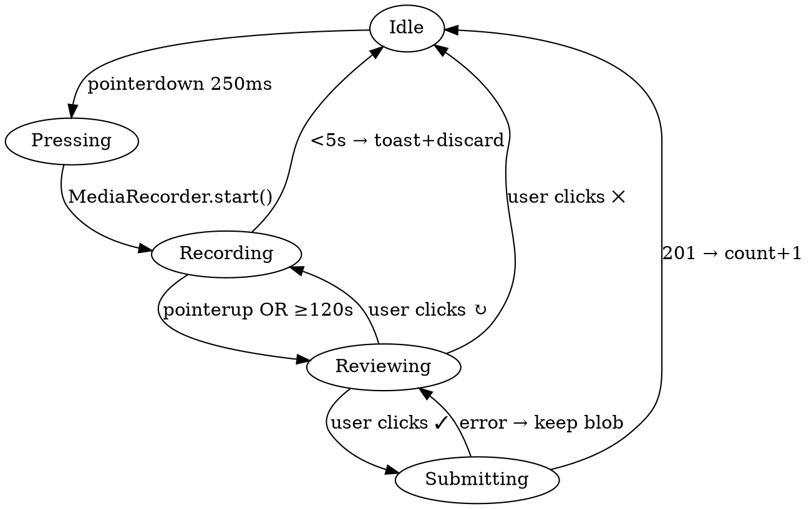

# Visitor Voice Notes — Design

**Date**: 2026-05-14
**Status**: Approved for implementation
**Scope**: Allow visitors to leave anonymous voice messages on any maker's card. Card owner and admin can review, play and delete messages. Voice-only (no text comments) to discourage scraping/spam.

## Goals

- Visitors can leave a 5–120s voice note on any card without authentication.
- Card owner (with maker key) and admin see the list of voice notes, can play and delete them.
- Visitor identity is anonymous, but enough metadata (hashed IP, country, city, UA, timestamp, duration) is kept for context and abuse triage.
- Rate-limited to discourage spam (50 voices/day per IP across all cards).
- Visitor-facing flow is voice-only; there is no text comment input.

## User-facing flow

1. Visitor sees a mic button at the bottom-right corner of a card (both front and back). The button shows a count badge if `voice_count > 0`.
2. Visitor long-presses the button (250ms threshold) → mic permission prompt → recording starts. A centred overlay shows a red pulsing circle and elapsed time.
3. Visitor releases the press:
   - If duration < 5s → toast "at least 5 seconds, please" and discard.
   - If duration ≥ 5s → a bottom sheet rises with native audio playback, and three actions: **↻ Re-record**, **✓ Send**, **✕ Cancel**.
4. Recording auto-stops at 120s and transitions to the sheet.
5. On **Send**: blob is uploaded as multipart; UI shows pending state, then on success the count badge increments and the sheet closes.
6. Errors (rate limit, network, oversize) surface as toasts and keep the recorded blob in the sheet for retry.

## Architecture

### High-level flow

```
visitor long-press mic
  → MediaRecorder (opus/webm preferred, mp4 on Safari)
  → release → review sheet
  → POST multipart to /api/voice/<cardId>
worker
  → validate (card exists, duration 5–120s, size ≤ 1MB, content-type)
  → rate-limit check (R2: voices/_rate/<date>/<ip-hash>.txt)
  → write voices/<cardId>/<voiceId>.<ext>
  → append meta to voices/<cardId>/index.json (etag-guarded write)
  → bump card.voice_count
  → bump rate counter
  → return { ok, voice_id, voice_count }
```

### Storage layout (R2 only, bucket `bushcraftchina2026`)

```
voices/
  <cardId>/
    index.json              ← meta index for one card
    <voiceId>.webm          ← audio file
    <voiceId>.mp4
  _rate/
    YYYY-MM-DD/
      <ip-hash>.txt         ← daily counter, content is plain integer
```

`<voiceId>` is 16 random bytes hex (32 chars). `<ip-hash>` is `sha256(ip + ADMIN_SALT).slice(0,16)`.

### Data model

`voices/<cardId>/index.json`:

```ts
interface VoiceMessage {
  id: string;             // 16-byte hex
  ext: "webm" | "mp4" | "ogg" | "m4a";
  duration_ms: number;
  size_bytes: number;
  content_type: string;
  ip_hash: string;        // sha256(ip + salt).slice(0,16)
  country?: string;       // from cf-ipcountry
  city?: string;          // from cf-ipcity
  ua?: string;            // truncated to 200 chars
  created_at: string;     // ISO 8601 UTC
}

interface VoiceIndex {
  items: VoiceMessage[];
}
```

`Card` interface (extension in `src/types.ts`):

```ts
interface Card {
  // ...existing fields
  voice_count?: number;   // mirror for fast card render
}
```

`Env` interface (extension):

```ts
interface Env {
  BUCKET: R2Bucket;
  ADMIN_SALT: string;     // wrangler secret
}
```

### IP hashing

- Never persist raw IP. Hash with secret salt: `sha256(ip + ADMIN_SALT).slice(0,16)`.
- `ADMIN_SALT` is a 32+ char random string, set via `wrangler secret put ADMIN_SALT`.
- Same IP yields a stable hash across days for cross-day analysis, but rate-limit files are partitioned by date so they auto-expire by directory.

## API

### `POST /api/voice/:cardId` — public submit

Request: `multipart/form-data`
- `audio`: File (audio blob)
- `duration_ms`: stringified integer (client-measured; server enforces bounds)

Auth: none.

Validation chain (any failure short-circuits):
1. cardId exists → else 404.
2. `duration_ms` ∈ [5000, 120000] → else 400.
3. `content-type` ∈ {audio/webm, audio/mp4, audio/ogg, audio/x-m4a} → else 415.
4. body size ≤ 1 MB → else 413 (use Content-Length pre-check; reject before reading full body).
5. magic-number sniff (first 16 bytes match WebM/EBML, ISO base media, or Ogg) → else 415.
6. rate limit: read `voices/_rate/<today>/<ip-hash>.txt`, current count < 50 → else 429.

Write order (rollback on failure):
1. Generate `voiceId`.
2. Write audio object.
3. Etag-guarded append to `voices/<cardId>/index.json` (read → mutate → write with `onlyIf`). On conflict, retry up to 3 times with re-read.
4. Etag-guarded bump of `cards/<cardId>.json` `voice_count`.
5. Bump rate counter (best-effort; failure does NOT roll back the voice).

Response `201`:
```json
{
  "ok": true,
  "voice_id": "<voiceId>",
  "voice_count": 7
}
```

Errors: `400`, `404`, `413`, `415`, `429`, `500`.

### `GET /voices/:cardId/:filename` — public audio stream

- Mirror of existing `/images/:id/:filename`.
- Headers: `cache-control: public, max-age=2592000` (30 days), `etag` from R2.
- 404 if missing.

### `GET /api/card/:id/voices` — list voices (maker or admin)

Auth: `requireAuth` + `canEditCard` (existing helpers).

Response `200`:
```json
{
  "items": [
    {
      "id": "...",
      "ext": "webm",
      "duration_ms": 23400,
      "size_bytes": 92160,
      "content_type": "audio/webm;codecs=opus",
      "country": "JP",
      "city": "Tokyo",
      "ip_hash": "9c84a1b...",
      "ua": "Mozilla/5.0 ...",
      "created_at": "2026-05-14T10:23:45.123Z",
      "audio_url": "/voices/<cardId>/abc123.webm"
    }
  ]
}
```

### `DELETE /api/voice/:cardId/:voiceId` — delete one

Auth: `requireAuth` + `canEditCard`.

Steps:
1. Remove entry from `voices/<cardId>/index.json` (etag-guarded).
2. Delete audio object.
3. Decrement `card.voice_count`.

Response `200`: `{ "ok": true, "voice_count": 6 }`.

## Frontend

### Mic button

Rendered as a child of `.card-front` AND `.card-back` (one per face) in `src/templates/card.ts`:

```html
<button class="voice-trigger" type="button" data-card="<id>"
        aria-label="leave a voice note">
  <svg class="voice-mic-icon" width="18" height="18" viewBox="0 0 24 24">
    <!-- mic shape -->
  </svg>
  <span class="voice-count" hidden>0</span>
</button>
```

Styling:
- `position: absolute; bottom: 24px; right: 24px;`
- 44×44px circle, `background: rgba(245,242,235,0.92); backdrop-filter: blur(6px);`
- Badge `.voice-count`: top-right absolute, accent green pill, Montserrat 600 10px.
- `.recording` modifier: red glow + pulse animation.
- Hidden via `aria-hidden` if `MediaRecorder` is unsupported.

### Recording overlay + bottom sheet

Inserted into `layout.ts` body (single instance, controlled per card by `data-card`):

```html
<div class="recording-overlay" id="recOverlay" hidden>
  <div class="rec-circle"><span class="rec-time">0:00</span></div>
  <div class="rec-hint">Recording · release to stop</div>
</div>

<div class="voice-sheet" id="voiceSheet" hidden>
  <div class="voice-sheet-header"><span id="voiceSheetDur">0:00</span></div>
  <audio id="voiceSheetAudio" controls preload="metadata"></audio>
  <div class="voice-sheet-actions">
    <button class="ghost" id="voiceRedo">↻ Re-record</button>
    <button class="primary" id="voiceSend">✓ Send</button>
  </div>
  <button class="voice-sheet-close" id="voiceCancel">cancel</button>
</div>
```

### Recording state machine (JS, ~120 LoC inline in `layout.ts`)



### MIME negotiation

```js
const candidates = [
  "audio/webm;codecs=opus",
  "audio/mp4;codecs=mp4a.40.2",
  "audio/ogg;codecs=opus",
];
const mime = candidates.find((m) => MediaRecorder.isTypeSupported(m));
new MediaRecorder(stream, { mimeType: mime, audioBitsPerSecond: 32000 });
```

32 kbps Opus on 120s ≈ 480 KB, well under 1 MB cap.

### Edge cases

| Scenario | Handling |
|---|---|
| MediaRecorder unsupported | Hide mic button via feature detect on mount |
| Mic permission denied | toast "Microphone access denied" → return to Idle |
| Upload interrupted | Sheet keeps the blob, shows "Retry" |
| `429` rate-limited | toast "You've reached today's voice limit (10)" |
| `413` oversize | toast "Recording too long" |
| `pointercancel` | treat as `pointerup` |
| User taps mic button (no hold) | no-op (single tap does not flip card either; flip-front handler ignores buttons) |

## Editor list (maker + admin)

New section in `renderEditForm` (in `src/templates/edit-form.ts`), inserted before save button:

```
<h2>voice notes from visitors（访客语音留言）</h2>

For each item:
  ROW 1: <date> · <country>/<city> · <duration> · <size>
  ROW 2: <audio controls> ............... [🗑 delete]
```

- Renders only if `voice_count > 0`; otherwise shows muted "no voice notes yet（暂无语音留言）".
- Delete button has `confirm("are you sure?")`, then `DELETE /api/voice/:cardId/:voiceId` AJAX; on 200 it removes the row from DOM and decrements the in-page count.
- Played via native `<audio controls>` element pointing at `/voices/<cardId>/<voiceId>.<ext>`.

Data load: editor route handler also reads `voices/<cardId>/index.json` and passes items to the template.

The same section is rendered identically whether accessed via maker key or admin key (the editor template doesn't branch).

## Security

| Risk | Mitigation |
|---|---|
| Bulk submit from one IP | 50/day hard cap, returns 429 |
| Oversize uploads | Content-Length pre-check + 1 MB cap, reject before reading body |
| Non-audio binary disguised as audio | Content-Type whitelist + first-16-byte magic-number sniff |
| Scraping/scripted spam | 250ms long-press gesture + 5s minimum + multipart submit deters trivial bots |
| Raw IP leakage | Only `sha256(ip + ADMIN_SALT).slice(0,16)` is persisted; salt is a wrangler secret |
| Concurrent writes to index.json | R2 conditional write (`onlyIf: etag`); on conflict retry up to 3 times |
| Path injection | `voiceId` server-generated hex; `cardId` from typed route param; no user-controlled file paths |
| Unauthorised delete | `requireAuth` + `canEditCard` reuses existing middleware |

## Testing

Unit (vitest with R2 mock):
- `utils/voices.appendVoice` — happy path; concurrent write retry succeeds; max retries exceeded fails clearly.
- `utils/voices.deleteVoice` — deletes existing; idempotent on missing.
- `utils/rate-limit` — 10th request succeeds; 11th rejected; cross-day reset (mock clock).
- `utils/ip-hash` — same (ip, salt) is deterministic; different salt diverges.

Route (vitest, in-memory app):
- `POST /api/voice/:cardId`: 4999ms → 400; 120001ms → 400; 1MB+1 → 413; bad content-type → 415; nonexistent card → 404; 11th today → 429; happy → 201 + count incremented + file exists.
- `DELETE /api/voice/:cardId/:voiceId`: no key → 403; wrong key → 403; admin key → 200; card's own key → 200; missing voiceId → 404.
- `GET /api/card/:id/voices`: unauth → 403; admin → list; card key → list.

Manual E2E (no automation):
- iOS Safari, Android Chrome, desktop Chrome/Firefox/Safari each record and submit a >5s message.
- Verify cf-ipcountry / cf-ipcity arrive in production (wrangler dev may lack these headers).
- Slow network: submit fails, retry succeeds, count is consistent.

## Migration / Compatibility

- Existing cards without `voice_count` are treated as `0` on read (`card.voice_count ?? 0`). No migration script needed.
- Existing R2 bucket reused; only the new `voices/` prefix is added.

## Deployment checklist

1. `npx wrangler secret put ADMIN_SALT` (paste a 32+ char random string).
2. `npm run deploy`.
3. Smoke test: record a 5s message on a test card; verify R2 has both the audio object and updated `voices/<id>/index.json`; verify the editor lists and can delete.
4. Production header check: confirm `cf-ipcountry` and `cf-ipcity` are present on requests (they should be when traffic comes through Cloudflare).

## Out of scope (YAGNI)

- Email/push notifications to maker when a new voice arrives.
- Speech-to-text transcription.
- Automated moderation (profanity, audio sentiment).
- Visitor identity (display name, signed cookie).
- Voice likes/replies/threading.
- Multi-language UI copy (English only for now).

## Files touched

New:
- `src/utils/voices.ts` — index read/append/delete with etag-guarded write.
- `src/utils/rate-limit.ts` — daily counter helper.
- `src/utils/ip-hash.ts` — hash helper.
- `src/routes/voices.ts` — POST/GET/DELETE handlers + audio stream.
- `test/voices.test.ts` — unit + route tests.

Modified:
- `src/types.ts` — extend `Card` with `voice_count?`; extend `Env` with `ADMIN_SALT`.
- `src/templates/card.ts` — add mic button to both faces.
- `src/templates/layout.ts` — recording overlay + voice sheet HTML, CSS, and inline JS state machine.
- `src/templates/edit-form.ts` — render voice notes section.
- `src/routes/edit.ts` — load voice index and pass to template; mount voices routes via main app.
- `src/index.ts` — `mountVoices(app)`.
- `wrangler.toml` — no change (R2 already bound; secret is set via CLI, not file).

## Open questions resolved during brainstorming

| Decision | Resolution |
|---|---|
| Mic placement | Bottom-right of both card faces |
| Max duration | 120 seconds |
| Rate limit | 50/day per IP across all cards |
| Confirm flow | Bottom sheet with Replay/Send/Re-record/Cancel; replay optional |
| Storage layout | Separate `voices/<cardId>/index.json` with mirrored `voice_count` on card.json |
| Deletion auth | Maker key OR admin key (same as edit permissions) |
| Rate-limit write failure | Best-effort, do not roll back the voice on counter write failure |
